# 🔮 TÀI LIỆU HỆ THỐNG BỐC BÀI VÀ LUẬN GIẢI TAROT AI (TAROT SYSTEM ARCHITECTURE)

Tài liệu này mô tả chi tiết toàn bộ kiến trúc, luồng xử lý và cách thức vận hành của tính năng **Tarot AI** trong dự án **DiscordMikeBot**.

---

## 📑 MỤC LỤC
1. [Tổng Quan Hệ Thống](#1-tổng-quan-hệ-thống)
2. [Sơ Đồ Kiến Trúc & Luồng Xử Lý (Architecture Flow)](#2-sơ-đồ-kiến-trúc--luồng-xử-lý)
3. [Cấu Trúc Các Module Cốt Lõi](#3-cấu-trúc-các-module-cốt-lõi)
   - [3.1. Module Dữ Liệu Bài (`deck.py`)](#31-module-dữ-liệu-bài-deckpy)
   - [3.2. Module Sinh Ảnh & Vẽ Quẻ (`renderer.py`)](#32-module-sinh-ảnh--vẽ-quẻ-rendererpy)
   - [3.3. Module Trí Tuệ Nhân Tạo & Fallback Cascade (`ai.py`)](#33-module-trí-tuệ-nhân-tạo--fallback-cascade-aipy)
   - [3.4. Module Giao Diện Tương Tác Gamification (`tarot_view.py`)](#34-module-giao-diện-tương-tác-gamification-tarot_viewpy)
   - [3.5. Module Quản Lý Cơ Sở Dữ Liệu SQLite (`manager.py`)](#35-module-quản-lý-cơ-sở-dữ-liệu-sqlite-managerpy)
   - [3.6. Module Điều Phối Discord Cog (`cog.py`)](#36-module-điều-phối-discord-cog-cogpy)
4. [Các Loại Trải Bài & Phong Cách Luận Giải](#4-các-loại-trải-bài--phong-cách-luận-giải)
5. [Quy Trình Tương Tác Từng Bước (Step-by-Step Execution)](#5-quy-trình-tương-tác-từng-bước)
6. [Cơ Chế Phục Hồi Lỗi & Chống Nghẽn (Resilience & Error Handling)](#6-cơ-chế-phục-hồi-lỗi--chống-nghẽn)
7. [Mô Hình Dữ Liệu SQLite (Database Schema)](#7-mô-hình-dữ-liệu-sqlite)

---

## 1. 🌟 Tổng Quan Hệ Thống

Hệ thống Tarot AI là sự kết hợp độc đáo giữa **Tương tác trực quan thời gian thực (Gamification)** và **Trí tuệ nhân tạo tạo sinh (Generative AI)**:
- **Bộ bài chuẩn 78 lá (Rider-Waite-Smith)**: Gồm 22 lá Ẩn chính (Major Arcana) và 56 lá Ẩn phụ (Minor Arcana: Wands, Cups, Swords, Pentacles) với đầy đủ ý nghĩa xuôi/ngược, nguyên tố, biểu tượng và chiêm tinh.
- **Trải nghiệm lật bài tương tác**: Thay vì trả về văn bản nhàm chán ngay lập tức, hệ thống dựng ảnh đồ họa quẻ bài úp $\rightarrow$ Người dùng bấm nút trên Discord để lật mở từng lá $\rightarrow$ Cả kênh chat cùng theo dõi sự thay đổi hình ảnh trực tiếp.
- **Xử lý bất đồng bộ song song (Parallel Non-blocking AI)**: Trong lúc người dùng đang lật bài, tác vụ AI của Google Gemini đã được kích hoạt chạy ngầm (`asyncio.create_task`). Khi người dùng lật xong, bài luận giải đã sẵn sàng ngay lập tức mà không phải chờ đợi.
- **Cơ chế dự phòng mô hình AI (Multi-tier Fallback Cascade)**: Đảm bảo độ tin cậy $99.9\%$, tự động chuyển đổi giữa các model Gemini nếu có sự cố nghẽn mạng hoặc quá tải quota.

---

## 2. 🗺️ Sơ Đồ Kiến Trúc & Luồng Xử Lý

```mermaid
sequenceDiagram
    autonumber
    actor User as Người dùng Discord
    participant Discord as Discord Gateway / Client
    participant Cog as TarotCog (cog.py)
    participant View as TarotLauncherView / TarotFlipView
    participant Deck as Deck & Randomizer (deck.py)
    participant Renderer as Image Renderer (renderer.py)
    participant AI as Gemini AI Engine (ai.py)
    participant DB as SQLite / ActivityLogger

    User->>Discord: Gọi /tarot hoặc $m tarot
    Discord->>Cog: Nhận Interaction / Message
    Cog->>View: Mở Menu Cấu hình (Chọn loại trải bài, phong cách, câu hỏi)
    User->>View: Bấm "🔮 Bắt đầu bốc bài"
    
    rect rgb(20, 30, 50)
        Note over View,Deck: Giai đoạn 1: Bốc bài & Khởi tạo
        View->>Deck: draw_spread(spread_key)
        Deck-->>View: Trả về danh sách lá bài (Xuôi / Ngược)
        View->>Renderer: render_spread_to_bytes(drawn_cards, revealed_indices={})
        Renderer-->>View: Buffer ảnh quẻ bài mặt úp (PNG)
        View->>AI: asyncio.create_task(generate_tarot_reading) [CHẠY NỀN]
    end

    View->>Discord: Gửi Embed + Ảnh bài úp + Hàng nút bấm lật bài

    rect rgb(30, 40, 20)
        Note over User,View: Giai đoạn 2: Tương tác lật bài Gamification
        loop Mỗi khi bấm lật 1 lá bài
            User->>Discord: Click nút [🃏 Vị trí X]
            Discord->>View: Interaction Callback
            View->>Renderer: Render lại ảnh với lá bài vừa mở
            Renderer-->>View: Ảnh quẻ bài đã lật thêm lá
            View->>Discord: Edit Message cập nhật ảnh mới & tắt nút bấm tương ứng
        end
    end

    rect rgb(40, 25, 40)
        Note over View,AI: Giai đoạn 3: Luận giải quẻ & Hoàn tất
        User->>View: Bấm "✨ Xem Luận Giải Chi Tiết" (hoặc đã lật hết)
        View->>AI: Await kết quả AI Task
        AI-->>View: Trả về bài luận giải thông điệp chiêm tinh
        View->>Discord: Cập nhật Embed cuối cùng (Ảnh ngửa hoàn toàn + Lời giải AI)
        View->>DB: Lưu tarot_history & tarot_daily_tracker
        View->>DB: Ghi nhận tổng thời gian xử lý vào Live Activity Logger
    end
```



---

## 3. 🧩 Cấu Trúc Các Module Cốt Lõi

Toàn bộ mã nguồn tính năng Tarot nằm trong thư mục `features/tarot/` với các thành phần chuyên biệt:

```
features/tarot/
├── __init__.py
├── deck.py          # 78 lá bài Tarot, từ điển ý nghĩa, định nghĩa trải bài, Reader & Card Fatigue
├── flavor.py        # [NEW] Phát hiện combo hiếm, Easter eggs & sinh Flavor Text huyền bí
├── renderer.py      # Bộ sinh đồ họa ảnh bài (Pillow), xếp layout đa dạng & In-memory Cache
├── ai.py            # Gemini AI: Structured JSON output, Trí nhớ bạn cũ, Follow-up & Semaphore
├── tarot_view.py    # UI Discord: Lật bài, Micro-interpretation, Follow-up Modal & Rating Buttons
├── manager.py       # Quản lý Turso Cloud LibSQL / SQLite DB, Lịch sử, Cooldown, Ratings & Preferences
├── cog.py           # Điều phối Slash commands, Prefix commands, Memory/Forget & Weekly Card Loop
└── assets/          # Thư mục chứa tài nguyên ảnh bài & font chữ Unicode
```

### 3.1. Module Dữ Liệu Bài (`deck.py`)
- **Lớp dữ liệu `TarotCard`**: Đại diện cho 1 lá bài với các trường:
  - `id`: Mã định danh (vd: `major_00`, `wands_01`).
  - `name_vi`, `name_en`: Tên tiếng Việt và tiếng Anh chuẩn.
  - `arcana_type`: Loại ẩn (`major` hoặc `minor`).
  - `suit`: Bộ ẩn phụ (`wands`, `cups`, `swords`, `pentacles` hoặc `None`).
  - `rank_number`: Giá trị số học (0 đến 21 hoặc 1 đến 14).
  - `element`, `astrology`: Nguyên tố (Lửa, Nước, Khí, Đất) và chòm sao chiêm tinh đại diện.
  - `keywords_upright`, `keywords_reversed`: Từ khóa ý nghĩa xuôi và ngược.
  - `meaning_upright`, `meaning_reversed`: Diễn giải biểu tượng chi tiết.
  - `symbols`: Danh sách biểu tượng đồ họa trên lá bài.
- **Lớp dữ liệu `DrawnCard`**: Đại diện cho lá bài được rút ra trong quẻ, gắn liền với:
  - `card`: Đối tượng `TarotCard`.
  - `is_reversed`: Trạng thái đảo ngược (`True`/`False`).
  - `position_index`, `position_title`, `position_desc`: Vị trí và ý nghĩa vị trí trong quẻ (ví dụ: *"Quá khứ"*, *"Lời khuyên"*).
- **Hàm `draw_spread(spread_key)`**: Rút ngẫu nhiên các lá bài không trùng lặp, tính toán ngẫu nhiên tỷ lệ ngược ($\approx 30\% - 40\%$) mô phỏng xào bài thực tế.

---

### 3.2. Module Sinh Ảnh & Vẽ Quẻ (`renderer.py`)
Sử dụng thư viện **Pillow (PIL)** để tạo ảnh chất lượng cao mà không phụ thuộc vào trình duyệt ngoài:
- **Tự động sinh ảnh Procedural Card**:
  - Vẽ khung viền mạ vàng phong cách cổ điển huyền bí.
  - Vẽ họa tiết hoa văn góc, biểu tượng nguyên tố trung tâm (Gậy, Cốc, Kiếm, Tiền, Mặt Trời, Mặt Trăng...).
  - Render tên tiếng Việt & tiếng Anh của lá bài với font chữ nghệ thuật.
  - Tự động xoay $180^\circ$ khi lá bài ở trạng thái **[NGƯỢC]** kèm dải băng thông báo trực quan.
- **Mặt lưng bài (Card Back)**:
  - Mặt lưng huyền bí với họa tiết hình học thiên văn (Sacred Geometry) khi lá bài chưa được lật.
- **Hỗ trợ đa dạng Layout trải bài**:
  - **1 Lá (Daily / Yes-No / Single)**: Căn giữa khung hình cân đối.
  - **3 Lá (Past-Present-Future / Mind-Body-Spirit)**: Xếp ngang tỷ lệ vàng.
  - **4 & 5 Lá (Choices / Horseshoe / Two Paths)**: Bố cục lưới 2 hàng hoặc đối xứng quan hệ.
  - **10 Lá (Celtic Cross)**: Layout chữ thập lồng ghép bên trái (Lá 1-6) + Cột 4 lá dọc bên phải (Lá 7-10) chuẩn xác theo sách cổ Tarot.
- **Xuất ảnh siêu tốc**: Kết xuất dưới dạng `io.BytesIO()` chuẩn định dạng PNG và gửi qua Discord Attachment (`attachment://tarot_spread.png`).

---

### 3.3. Module Trí Tuệ Nhân Tạo & Fallback Cascade (`ai.py`)
Sử dụng SDK mới nhất của Google (`google-genai`):

#### Danh sách Model Fallback Cascade:
Khi gọi AI, hệ thống sẽ tuần tự thử qua các model:
1. `gemini-2.5-flash` *(Ưu tiên 1 - Tốc độ nhanh nhất, thông minh)*
2. `gemini-2.5-pro` *(Ưu tiên 2 - Sâu sắc, phân tích đa chiều)*
3. `gemini-2.0-flash` *(Ưu tiên 3 - Dự phòng hiệu năng cao)*
4. `gemini-1.5-flash` *(Ưu tiên 4 - Ổn định)*
5. `gemma-4-31b-it` *(Ưu tiên 5 - Fallback mã nguồn mở)*

- **Cơ chế Timeout 12 giây**: Mỗi model chỉ được tối đa 12s để phản hồi. Nếu bị trễ hoặc nghẽn, lập tức fallback sang model kế tiếp để tránh làm gián đoạn trải nghiệm người dùng.
- **Prompt Engineering chuyên sâu**:
  - Tích hợp tính cách theo từng **Reader Style** (`neutral`, `healer`, `chaos`).
  - Gợi mở câu hỏi người dùng đặt ra kết hợp với bối cảnh cuộc sống.
  - Phân tích tương quan giữa các lá bài, sự chuyển dịch từ Quá khứ sang Tương lai hoặc mâu thuẫn giữa 2 lựa chọn.
  - Dọn dẹp lời chào rườm rà qua Regex, trả về văn bản mạch lạc, bố cục rõ ràng với emoji tinh tế.

---

### 3.4. Module Giao Diện Tương Tác Gamification (`tarot_view.py`)

Gồm 2 tầng View Discord UI:
1. **`TarotLauncherView`**:
   - Menu Dropdown chọn trải bài (`Select Spread`).
   - Menu Dropdown chọn phong cách bốc bài (`Select Reader Style`).
   - Nút *"🔮 Bắt đầu bốc bài"* & Nút *"📜 Lịch sử bốc bài"*.
2. **`TarotFlipView` (Interactive Flipping)**:
   - Sinh động với các nút bấm đại diện cho từng vị trí lá bài: `[🃏 Lá 1]`, `[🃏 Lá 2]`, `[🃏 Lá 3]`...
   - **Realtime Flip Update**: Mỗi khi người dùng bấm nút:
     - Nút đó sẽ bị vô hiệu hóa (`disabled=True`) và đổi nhãn thành `[✅ Đã lật: Tên Lá]`.
     - Renderer vẽ lại ảnh mới (thay thế mặt lưng bài bằng mặt trước của lá vừa lật).
     - Cập nhật embed Discord ngay lập tức.
   - **Nút "⚡ Lật Tất Cả"**: Hỗ trợ mở toàn bộ bài cùng lúc nếu người dùng không muốn bấm từng lá.
   - **Đo lường thời gian xử lý thực tế**: Ghi nhận `start_time` từ lúc mở quẻ đến khi hoàn tất để thống kê hiệu năng.

---

### 3.5. Module Quản Lý Cơ Sở Dữ Liệu SQLite (`manager.py`)
- **Chế độ WAL (Write-Ahead Logging)**: Cho phép đọc/ghi đồng thời với hiệu năng cực cao.
- **Quản lý Daily Cooldown (Giờ Việt Nam GMT+7)**:
  - Mỗi người dùng chỉ được rút 1 lá Daily mỗi ngày.
  - Nếu rút lại trong cùng ngày, bot sẽ trả về kết quả lá bài đã rút trước đó kèm lời nhắc tinh tế.
- **Anti-Spam User Cooldown (30 giây)**: Ngăn chặn tình trạng spam lệnh liên tục làm nghẽn tài nguyên server.

---

### 3.6. Module Điều Phối Discord Cog (`cog.py`)
- **Slash Commands**:
  - `/tarot`: Mở giao diện tương tác đầy đủ kèm tùy chọn câu hỏi, bối cảnh, trải bài, phong cách.
  - `/tarot history`: Xem lại lịch sử các lần bốc bài gần nhất.
- **Prefix Commands**:
  - `$m tarot`, `$m xemque`, `$m bocadoi`...
  - Hỗ trợ các bí danh (aliases) linh hoạt: `daily`, `3la`, `yn`, `celtic`, `choices`...
- **Tự động Autocomplete**: Hỗ trợ gợi ý các kiểu trải bài và phong cách ngay khi người dùng gõ lệnh trên Discord.

---

## 4. 🎴 Các Loại Trải Bài & Phong Cách Luận Giải

### 4.1. Danh Sách 8 Kiểu Trải Bài

| Mã Trải Bài | Tên Trải Bài | Số Lá | Mục Đích Sử Dụng |
| :--- | :--- | :---: | :--- |
| `daily` | **Daily Card (Năng lượng ngày)** | 1 lá | Nhận thông điệp chỉ dẫn và năng lượng chủ đạo trong ngày. |
| `yes_no` | **Yes / No Oracle (Phán quyết)** | 1 lá | Giải đáp câu hỏi Đúng/Sai hoặc Có/Không kèm tỷ lệ phán quyết. |
| `single` | **Single Card (Một lá chuyên sâu)** | 1 lá | Tập trung khai mở bản chất một vấn đề cụ thể. |
| `ppf` | **Quá khứ - Hiện tại - Tương lai** | 3 lá | Dòng chảy thời gian của sự việc và diễn biến sắp tới. |
| `mbs` | **Tâm trí - Cơ thể - Tinh thần** | 3 lá | Khám phá tình trạng sức khỏe tinh thần và năng lượng bên trong. |
| `choices` | **Hai Ngã Rẽ / Lựa Chọn** | 5 lá | Phân tích 2 hướng đi A và B, so sánh rủi ro và kết quả. |
| `horseshoe` | **Móng Ngựa (Horseshoe Spread)** | 5 lá | Đánh giá tổng quan sự việc, yếu tố ẩn giấu và lời khuyên then chốt. |
| `celtic` | **Celtic Cross (Thập Tự Cổ Điển)** | 10 lá | Trải bài kinh điển và chi tiết nhất: Thực trạng, Trở ngại, Cội nguồn, Quá khứ, Tương lai gần, Tâm thế, Ngoại cảnh, Hy vọng/Nỗi sợ và Kết cục. |

---

### 4.2. Danh Sách 3 Phong Cách Reader

| Phong Cách | Biểu Tượng | Đặc Điểm Giọng Văn & Phong Thái |
| :--- | :---: | :--- |
| `neutral` | 🧙‍♂️ | **Chiêm tinh gia thông thái**: Khách quan, chuẩn mực, học thuật, phân tích đa chiều. |
| `healer` | 🌿 | **Người chữa lành (Healer)**: Dịu dàng, thấu cảm, vỗ về tâm hồn, hướng đến bình an. |
| `chaos` | 😈 | **Nhà tiên tri "Cà khịa" (Chaos/Savage)**: Hài hước, châm biếm sâu cay, nói thẳng sự thật nhưng trúng tim đen. |

---

## 5. 🚀 Quy Trình Tương Tác Từng Bước

1. **Khởi chạy lệnh**:
   - Người dùng gõ `/tarot` hoặc `$m tarot "Tôi có nên đổi việc không?"`.
2. **Chọn thông số quẻ**:
   - Menu xuất hiện $\rightarrow$ Chọn Trải bài (vd: `Quá khứ - Hiện tại - Tương lai`) $\rightarrow$ Chọn Phong cách (`Healer`) $\rightarrow$ Bấm *"🔮 Bắt đầu bốc bài"*.
3. **Bốc bài & Khởi động AI ngầm**:
   - Server bốc 3 lá ngẫu nhiên (vd: *The Fool*, *Three of Swords [NGƯỢC]*, *The Star*).
   - Render ảnh 3 lá mặt úp.
   - Gửi yêu cầu phân tích sang Gemini AI chạy nền.
4. **Lật bài trực tiếp**:
   - Người dùng click từng nút `[🃏 Lá 1]`, `[🃏 Lá 2]`, `[🃏 Lá 3]`.
   - Mỗi lần click, ảnh cập nhật lá bài ngửa ra trực tiếp trong kênh.
5. **Đón nhận luận giải**:
   - Khi hoàn tất lật bài, bài luận giải từ Gemini AI được nhúng vào Embed với đầy đủ phân tích chi tiết, lời khuyên và tổng kết.
6. **Lưu trữ & Thống kê**:
   - Ghi lại lịch sử bốc bài vào SQLite Database.
   - Bắn thông tin tương tác và thời gian xử lý thực tế sang **Live Activity Logger** trên Web Admin Console.

---

## 6. 🛡️ Cơ Chế Phục Hồi Lỗi & Chống Nghẽn

- **Xử lý thiếu quyền Discord (`discord.Forbidden`)**:
  - Nếu bot không có quyền `Attach Files` hoặc `Embed Links`, bot sẽ tự động bắt lỗi và thông báo hướng dẫn quản trị viên cấp quyền tối thiểu thay vì sập cog.
- **Xử lý lỗi mạng / Timeout AI**:
  - Mỗi model Gemini chạy trong luồng có `asyncio.wait_for(timeout=12.0)`.
  - Nếu quá 12s hoặc gặp lỗi $503 / 429$, bot tự chuyển sang model tiếp theo trong danh sách Fallback.
  - Nếu tất cả các model đều gặp sự cố, hệ thống có lời nhắn dự phòng hướng dẫn người dùng tự chiêm nghiệm từ hình ảnh các lá bài đã lật.
- **Xử lý Rate Limit / Anti-Spam**:
  - Giới hạn 30s giữa các lần gọi lệnh để tránh cạn kiệt tài nguyên xử lý đồ họa và API AI.

---

## 7. 💾 Mô Hình Dữ Liệu SQLite

Hệ thống sử dụng file cơ sở dữ liệu `data/bot_database.db` với 2 bảng chuyên trách:

### Bảng `tarot_history` (Lưu lịch sử bốc bài)
```sql
CREATE TABLE IF NOT EXISTS tarot_history (
    id           INTEGER PRIMARY KEY AUTOINCREMENT,
    user_id      INTEGER NOT NULL,
    guild_id     INTEGER,
    channel_id   INTEGER,
    spread_type  TEXT NOT NULL,
    question     TEXT,
    cards_json   TEXT NOT NULL,      -- Mảng JSON lưu thông tin các lá bài rút ra
    ai_reading   TEXT,               -- Toàn văn bài luận giải của AI
    created_at   TEXT NOT NULL DEFAULT (datetime('now'))
);
```

### Bảng `tarot_daily_tracker` (Kiểm soát lượt bốc Daily)
```sql
CREATE TABLE IF NOT EXISTS tarot_daily_tracker (
    user_id         INTEGER PRIMARY KEY,
    last_daily_date TEXT NOT NULL,      -- Chuỗi ngày dạng YYYY-MM-DD (GMT+7)
    last_drawn_json TEXT NOT NULL,      -- Thông tin lá bài đã rút trong ngày
    updated_at      TEXT NOT NULL DEFAULT (datetime('now'))
);
```

---

*Tài liệu được cập nhật tự động đồng bộ với phiên bản mã nguồn mới nhất của DiscordMikeBot.*
