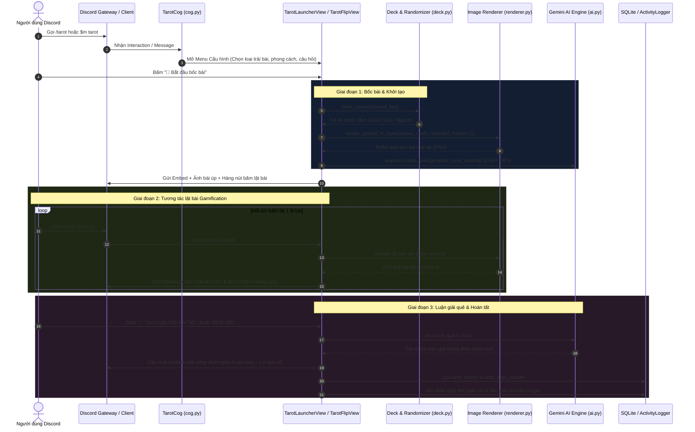

# 🔮 TÀI LIỆU HỆ THỐNG BỐC BÀI VÀ LUẬN GIẢI TAROT AI (TAROT SYSTEM ARCHITECTURE)

Tài liệu này mô tả kiến trúc và luồng xử lý **Tarot hiện đang chạy** của Asumi (repository DiscordMikeBot).

**Asumi 3.13.2 (2026-10-09):** Khi nhận lời gọi @Asumi có câu hỏi Tarot, bot giữ câu hỏi qua `features/assistant/router.py` → `features/assistant/tools.py` → `TarotCog`. Nếu có yêu cầu bốc/rút/bói kèm câu hỏi rõ, bot dùng command Tarot sẵn có để rút theo spread đề xuất, giữ cooldown. Nếu không yêu cầu rút ngay thì mở launcher với câu hỏi điền sẵn. Daily vẫn là thao tác riêng, không suy từ mọi câu chứa “hôm nay”.

> **Tarot roadmap T20.1–T20.9 đã hoàn tất; runtime hiện được phát hành trong Asumi 3.0.0 với Tarot 2.x làm subsystem chính.** Asumi 3.0 thêm launcher UX question-first + one-tap Daily + one-click recommendation trên baseline Tarot 2.1.

> v2.8.0: Asumi là nhân vật Tarot duy nhất. `auto` là mặc định; `neutral`, `healer`, `chaos` là các style ID tương thích dữ liệu cũ, nay hiển thị lần lượt là Tĩnh, Dịu, Tinh quái. Prompt mới điều chỉnh cách nói theo câu hỏi, vẫn dùng schema JSON và các ranh giới an toàn hiện có.

> v2.9.0 / T20.5: kết quả cuối có action **🃏 Làm rõ**. Chủ quẻ chọn một vị trí thật trong spread; engine rút đúng một lá mới không trùng bất kỳ lá gốc nào, render Clarifier Board giữ nguyên original spread và chỉ diễn giải quan hệ TARGET → CLARIFIER. Mỗi reading mặc định tối đa 1 clarifier và chỉ tiêu lượt sau delivery thành công.

---

## 📑 MỤC LỤC
1. [Tổng Quan Hệ Thống](#1-tổng-quan-hệ-thống)
2. [Sơ Đồ Kiến Trúc & Luồng Xử Lý (Architecture Flow)](#2-sơ-đồ-kiến-trúc--luồng-xử-lý)
3. [Cấu Trúc Các Module Cốt Lõi](#3-cấu-trúc-các-module-cốt-lõi)
   - [3.1. Module Dữ Liệu Bài (`deck.py`)](#31-module-dữ-liệu-bài-deckpy)
   - [3.2. Module Sinh Ảnh & Vẽ Quẻ (`renderer.py`)](#32-module-sinh-ảnh--vẽ-quẻ-rendererpy)
   - [3.3. Module Trí Tuệ Nhân Tạo & Fallback Cascade (`ai.py`)](#33-module-trí-tuệ-nhân-tạo--fallback-cascade-aipy)
   - [3.4. Module Giao Diện Tương Tác Gamification (`tarot_view.py`)](#34-module-giao-diện-tương-tác-gamification-tarot_viewpy)
   - [3.5. Module Quản Lý Cơ Sở Dữ Liệu SQLite (`manager.py`)](#35-module-quản-lý-cơ-sở-dữ-liệu-sqlite-managerpy)
   - [3.6. Module Điều Phối Discord Cog (`cog.py`)](#36-module-điều-phối-discord-cog-cogpy)
4. [Các Loại Trải Bài & Phong Cách Luận Giải](#4-các-loại-trải-bài--phong-cách-luận-giải)
5. [Quy Trình Tương Tác Từng Bước (Step-by-Step Execution)](#5-quy-trình-tương-tác-từng-bước)
6. [Cơ Chế Phục Hồi Lỗi & Chống Nghẽn (Resilience & Error Handling)](#6-cơ-chế-phục-hồi-lỗi--chống-nghẽn)
7. [Mô Hình Dữ Liệu SQLite (Database Schema)](#7-mô-hình-dữ-liệu-sqlite)

---

## 1. 🌟 Tổng Quan Hệ Thống

Hệ thống Tarot AI là sự kết hợp độc đáo giữa **Tương tác trực quan thời gian thực (Gamification)** và **Trí tuệ nhân tạo tạo sinh (Generative AI)**:
- **Bộ bài chuẩn 78 lá (Rider-Waite-Smith)**: Gồm 22 lá Ẩn chính (Major Arcana) và 56 lá Ẩn phụ (Minor Arcana: Wands, Cups, Swords, Pentacles) với đầy đủ ý nghĩa xuôi/ngược, nguyên tố, biểu tượng và chiêm tinh.
- **Trải nghiệm lật bài tương tác**: Thay vì trả về văn bản nhàm chán ngay lập tức, hệ thống dựng ảnh đồ họa quẻ bài úp $\rightarrow$ Người dùng bấm nút trên Discord để lật mở từng lá $\rightarrow$ Cả kênh chat cùng theo dõi sự thay đổi hình ảnh trực tiếp.
- **Xử lý bất đồng bộ song song (Parallel Non-blocking AI)**: Trong lúc người dùng đang lật bài, tác vụ AI của Google Gemini đã được kích hoạt chạy ngầm (`asyncio.create_task`). Khi người dùng lật xong, bài luận giải đã sẵn sàng ngay lập tức mà không phải chờ đợi.
- **Cơ chế dự phòng mô hình AI (Multi-tier Fallback Cascade)**: Đảm bảo độ tin cậy $99.9\%$, tự động chuyển đổi giữa các model Gemini nếu có sự cố nghẽn mạng hoặc quá tải quota.

---

## 2. 🗺️ Sơ Đồ Kiến Trúc & Luồng Xử Lý


```mermaid
sequenceDiagram
    autonumber
    actor User as Người dùng Discord
    participant Discord as Discord Gateway / Client
    participant Cog as TarotCog (cog.py)
    participant View as TarotLauncherView / TarotFlipView
    participant Deck as Deck & Randomizer (deck.py)
    participant Renderer as Image Renderer (renderer.py)
    participant AI as Gemini AI Engine (ai.py)
    participant DB as SQLite / ActivityLogger

    User->>Discord: Gọi /tarot hoặc $m tarot
    Discord->>Cog: Nhận Interaction / Message
    Cog->>View: Mở Menu Cấu hình (Chọn loại trải bài, phong cách, câu hỏi)
    User->>View: Bấm "🔮 Bắt đầu bốc bài"
    
    rect rgb(20, 30, 50)
        Note over View,Deck: Giai đoạn 1: Bốc bài & Khởi tạo
        View->>Deck: draw_spread(spread_key)
        Deck-->>View: Trả về danh sách lá bài (Xuôi / Ngược)
        View->>Renderer: render_spread_to_bytes(drawn_cards, revealed_indices={})
        Renderer-->>View: Buffer ảnh quẻ bài mặt úp (PNG)
        View->>AI: asyncio.create_task(generate_tarot_reading) [CHẠY NỀN]
    end

    View->>Discord: Gửi Embed + Ảnh bài úp + Hàng nút bấm lật bài

    rect rgb(30, 40, 20)
        Note over User,View: Giai đoạn 2: Tương tác lật bài Gamification
        loop Mỗi khi bấm lật 1 lá bài
            User->>Discord: Click nút [🃏 Vị trí X]
            Discord->>View: Interaction Callback
            View->>Renderer: Render lại ảnh với lá bài vừa mở
            Renderer-->>View: Ảnh quẻ bài đã lật thêm lá
            View->>Discord: Edit Message cập nhật ảnh mới & tắt nút bấm tương ứng
        end
    end

    rect rgb(40, 25, 40)
        Note over View,AI: Giai đoạn 3: Luận giải quẻ & Hoàn tất
        User->>View: Bấm "✨ Xem Luận Giải Chi Tiết" (hoặc đã lật hết)
        View->>AI: Await kết quả AI Task
        AI-->>View: Trả về bài luận giải thông điệp chiêm tinh
        View->>Discord: Cập nhật Embed cuối cùng (Ảnh ngửa hoàn toàn + Lời giải AI)
        View->>DB: Lưu tarot_history & tarot_daily_tracker
        View->>DB: Ghi nhận tổng thời gian xử lý vào Live Activity Logger
    end
```

---

## 3. 🧩 Cấu Trúc Các Module Cốt Lõi

Toàn bộ mã nguồn tính năng Tarot nằm trong thư mục `features/tarot/` với các thành phần chuyên biệt:

```
features/tarot/
├── __init__.py
├── deck.py          # 78 lá bài Tarot, từ điển ý nghĩa, định nghĩa trải bài, Reader & Card Fatigue
├── flavor.py        # [NEW] Phát hiện combo hiếm, Easter eggs & sinh Flavor Text huyền bí
├── renderer.py      # Bộ sinh đồ họa ảnh bài (Pillow), xếp layout đa dạng & In-memory Cache
├── ai.py            # Gemini AI: Structured JSON output, Trí nhớ bạn cũ, Follow-up & Semaphore
├── tarot_view.py    # UI Discord: Launcher + live reading session + Follow-up/Rating
├── reading/
│   ├── schema.py    # Structured Reading Result V2
│   ├── recommendation.py # Smart launcher recommendation + repeated-question helper
│   ├── clarifier.py # Resolve AI-suggested targets + existing target insight
│   ├── custom_spread.py # T20.7 schema-only Smart Custom Spread validation
│   ├── journey.py # T20.8 stored-history analytics for Tarot Journey
│   ├── recap.py # T20.9 deterministic Recap Card content selection
│   └── session.py   # Progress, micro reveal, compact controls & AI-ready presentation helpers
├── rendering/
│   └── state.py     # ReadingBoardState: reveal/final/key/target state independent from Discord UI
├── manager.py       # Quản lý Turso Cloud LibSQL / SQLite DB, Lịch sử, Cooldown, Ratings & Preferences
├── cog.py           # Điều phối Slash commands, Prefix commands, Memory/Forget & Weekly Card Loop
└── assets/          # Thư mục chứa tài nguyên ảnh bài & font chữ Unicode
```

### 3.1. Module Dữ Liệu Bài (`deck.py`)
- **Lớp dữ liệu `TarotCard`**: Đại diện cho 1 lá bài với các trường:
  - `id`: Mã định danh (vd: `major_00`, `wands_01`).
  - `name_vi`, `name_en`: Tên tiếng Việt và tiếng Anh chuẩn.
  - `arcana_type`: Loại ẩn (`major` hoặc `minor`).
  - `suit`: Bộ ẩn phụ (`wands`, `cups`, `swords`, `pentacles` hoặc `None`).
  - `rank_number`: Giá trị số học (0 đến 21 hoặc 1 đến 14).
  - `element`, `astrology`: Nguyên tố (Lửa, Nước, Khí, Đất) và chòm sao chiêm tinh đại diện.
  - `keywords_upright`, `keywords_reversed`: Từ khóa ý nghĩa xuôi và ngược.
  - `meaning_upright`, `meaning_reversed`: Diễn giải biểu tượng chi tiết.
  - `symbols`: Danh sách biểu tượng đồ họa trên lá bài.
- **Lớp dữ liệu `DrawnCard`**: Đại diện cho lá bài được rút ra trong quẻ, gắn liền với:
  - `card`: Đối tượng `TarotCard`.
  - `is_reversed`: Trạng thái đảo ngược (`True`/`False`).
  - `position_index`, `position_title`, `position_desc`: Vị trí và ý nghĩa vị trí trong quẻ (ví dụ: *"Quá khứ"*, *"Lời khuyên"*).
- **Hàm `draw_spread(spread_key)`**: Rút ngẫu nhiên các lá bài không trùng lặp, tính toán ngẫu nhiên tỷ lệ ngược ($\approx 30\% - 40\%$) mô phỏng xào bài thực tế.

---

### 3.2. Module Sinh Ảnh & Reading Board 2.0 (`renderer.py`, `rendering/state.py`)
Sử dụng **Pillow (PIL)** nhưng từ T20.4 renderer không còn chỉ ghép card; nó nhận một `ReadingBoardState` độc lập với Discord UI.

- **Visual direction**: dark celestial + muted violet + warm gold + blue-grey; card art là focal point, decoration bị tiết chế để đọc tốt trên mobile.
- **State contract**:
  - face-down / revealed;
  - just revealed (`NEW`);
  - AI-selected key card (`KEY`);
  - target position (`TARGET`) cho Clarifier sau này;
  - final board.
- **Accessibility**:
  - vị trí luôn nằm trực tiếp trên board;
  - progress có cả số lượng và dots khi đang reveal;
  - lá ngược vẫn xoay 180° nhưng đồng thời có marker `REV` / text `NGƯỢC`;
  - Major Arcana có marker `MAJOR`;
  - state quan trọng không chỉ phụ thuộc màu.
- **Responsive fixed layouts**:
  - **1 lá**: portrait `1080×1350`;
  - **3 lá**: horizontal `1400×900`;
  - **Two Paths 5 lá**: dedicated branch board `1400×1100`;
  - **Horseshoe 5 lá**: dedicated arc board `1500×1100`;
  - **Celtic 10 lá**: `1600×1350`, giữ cross + staff structure.
- **Generic dynamic layouts** đã chuẩn bị cho Smart Custom Spread: 4-card diamond, generic 5-card cross, 6-card 2×3, 7-card arc và bounded grid cho count khác.
- **Final Board**: sau khi AI structured result sẵn sàng, board được render lại với `FINAL SPREAD` và highlight key card do AI chọn, không đổi card order/outcome.
- **Fallback**: nếu composition lỗi, renderer sinh text-first fallback board từ đúng các lá đã rút thay vì làm fail toàn reading.
- **Cache**: card face/card back resized variants vẫn được cache in-memory.
- API cũ `render_spread_to_bytes(...)` được giữ để tương thích; internally nó chuyển thành `ReadingBoardState`.

---

### 3.3. Module Trí Tuệ Nhân Tạo & Fallback Cascade (`ai.py`)
Sử dụng SDK Google `google-genai` và từ T20.1 đã chuyển sang **Tarot Reading Engine 2.0**.

#### Model Fallback Cascade
`features/tarot/ai.py` dùng `config.TAROT_FALLBACK_MODELS` (hoặc danh sách mặc định trong module), bỏ model trùng và thử tuần tự. Timeout là 16 giây cho bài dưới 5 lá, 26 giây cho bài dài; follow-up/Why dùng 12 giây.

#### Prompt & structured reading V2
- **Asumi là reader duy nhất**; `auto`, `neutral`, `healer`, `chaos` vẫn giữ stable ID để tương thích dữ liệu/UI.
- `auto` có deterministic tone hint theo loại câu hỏi (quyết định, cảm xúc, vui, high-stakes), nhưng tone không thay đổi ý nghĩa lá bài.
- Prompt dùng contract `OBSERVE → CONNECT → INTERPRET → GROUND → UNCERTAINTY`: ưu tiên quan hệ giữa các lá thay vì đọc từng lá như mục từ điển.
- Anti-robot rules hạn chế lời chào mặc định, văn chữa lành chung chung và các câu lặp kiểu "Lá bài này cho thấy...".
- Model chính trả structured JSON qua `TarotAIResponseSchema`: core message, card insights, connections, dominant theme, key card, practical takeaway, uncertainty, clarifier targets và Journey tags.
- `TarotReadingResult` là rich application contract. Từ T20.4, interactive Tarot flow dùng `generate_tarot_reading_result(...)` trực tiếp để final board có thể lấy `key_card`; adapter `generate_tarot_reading(...)` vẫn giữ cho weekly/legacy callers.
- Parser vẫn chấp nhận JSON schema cũ và plain Markdown của fallback model, đồng thời không để JSON lỗi rò ra Discord.
- Existing follow-up prompt tiếp tục cùng quẻ, không giả vờ rút thêm lá và không kể lại toàn bộ reading.
- `generate_why_explanation(...)` đã sẵn sàng cho nút **Why?** ở milestone UX sau; output chỉ giải thích dựa trên lá/vị trí nhìn thấy, không expose hidden chain-of-thought.

Schema V2 nằm tại `features/tarot/reading/schema.py`.

---

### 3.4. Module Giao Diện Tương Tác Gamification (`tarot_view.py`)

Gồm 2 tầng View Discord UI:
1. **`TarotLauncherView` — Asumi 3 question-first + Daily quick path**:
   - Primary row ưu tiên **✏️ Nhập câu hỏi** và, khi chưa có câu hỏi, **☀️ Daily hôm nay**.
   - Có câu hỏi → `features/tarot/reading/recommendation.py` đề xuất spread cố định tức thì, không gọi AI; **✨ Trải theo đề xuất** chấp nhận recommendation và bắt đầu quẻ trong cùng một click.
   - Daily quick button bắt đầu `daily` ngay sau các cooldown check; không cần câu hỏi. Direct `/tarot spread:daily` và `.m tarot daily` vẫn giữ.
   - T20.7 **🧩 Tạo spread riêng** vẫn tồn tại cho câu hỏi cần cấu trúc 3–7 vị trí.
   - Manual spread và Reader Style được đưa xuống các select **Tuỳ chọn nâng cao**; khi user tự chọn manual/custom, nút **🎴 Bắt đầu** xuất hiện.
   - Nếu one-click Daily/recommendation bị cooldown/validation chặn, launcher rollback selection state để control đang hiển thị vẫn dùng lại được.
   - Slash `/tarot` và prefix `.m tarot` dùng cùng `TarotLauncherView`; `.m tarot <câu hỏi>` mở launcher với question prefilled và recommendation sẵn.
   - Nếu phát hiện câu hỏi gần giống lịch sử gần đây, launcher hiện cảnh báo nhẹ và cho chọn dùng ngữ cảnh cũ hoặc xem như câu hỏi mới.
2. **`TarotFlipView` — Live Reading Session từ T20.3**:
   - Một reading dùng **một message chính** xuyên suốt các trạng thái: xáo bài → mặt úp → đang lật → AI sẵn sàng/finalizing → kết quả.
   - Nút lật dùng nhãn số compact (`1`, `2`, …, `✓ 2`) để 10-card spread vẫn gọn trên mobile; `✨ Lật hết` vẫn được giữ.
   - **Reveal progress** luôn có cả dots và số lượng, ví dụ `● ○ ○   1 / 3 lá đã lật`.
   - Mỗi lá vừa lật nhận **micro reveal** deterministic: vị trí + tên lá + xuôi/ngược + tối đa 3 từ khóa. Không gọi AI thêm cho micro reveal.
   - AI chạy nền song song với việc lật bài. Nếu AI xong trước, message hiện `✓ Luận giải đã sẵn sàng` mà không tạo message mới.
   - Nếu user lật hết trước AI, chính message đó chuyển sang trạng thái **ĐANG LUẬN GIẢI** rồi được edit thành kết quả cuối.
   - `features/tarot/reading/session.py` chứa các presentation helper thuần để test độc lập.
     - Renderer vẽ lại ảnh mới (thay thế mặt lưng bài bằng mặt trước của lá vừa lật).
     - Cập nhật embed Discord ngay lập tức.
   - **Nút "⚡ Lật Tất Cả"**: Hỗ trợ mở toàn bộ bài cùng lúc nếu người dùng không muốn bấm từng lá.
   - **Đo lường thời gian xử lý thực tế**: Ghi nhận `start_time` từ lúc mở quẻ đến khi hoàn tất để thống kê hiệu năng.

---

#### Clarifier action — T20.5

- `TarotResultActionView` có nút **🃏 Làm rõ** owner-only.
- Picker ephemeral đưa tối đa hai target do structured reading gợi ý lên đầu, nhưng user vẫn có thể chọn bất kỳ vị trí thật nào.
- `draw_clarifier(...)` loại toàn bộ card id của spread gốc và seed theo exact original spread + target + question để retry không âm thầm reroll.
- AI chỉ nhận original reading + target evidence + clarifier đã được engine rút; output bị giới hạn để nằm an toàn trong Discord embed.
- Clarifier Board giữ nguyên spread bên trái, target được đánh dấu và panel riêng hiển thị TARGET → CLARIFIER.
- **Delivery là commit point**: lỗi trước/sau render hoặc cả attachment/text delivery đều không tiêu lượt; khi public output đã gửi thành công thì action chuyển sang **✓ Đã làm rõ** và persistence/logging chạy best-effort.

#### Multi-turn result session — T20.6

- `TarotResultActionView` owns a bounded `TarotSessionState` for post-reading interactions.
- A reading allows up to **3** follow-up questions during the result-view lifetime; each answer receives original context, prior follow-up turns and a delivered clarifier summary.
- Follow-up capacity is committed only after Discord delivery succeeds.
- **🔍 Vì sao?** is owner-only and one-use; it calls the evidence-facing Why generator and never exposes hidden chain-of-thought.
- The default result-view lifetime remains 600 seconds. On timeout, follow-up / clarifier / Why actions are disabled.
- Clarifier remains one-card, one-use, and is attached to the same session only as context for subsequent questions.

#### Smart Custom Spread — T20.7

- Launcher có **🧩 Trải bài riêng** sau khi người dùng nhập câu hỏi.
- AI chỉ tạo `title`, `intent`, `reason` và 3–7 vị trí; không được cấp card ID hay orientation.
- `reading/custom_spread.py` validate count/uniqueness/text bounds/card fields/private framing trước khi draw.
- `draw_custom_spread(...)` trong deck engine mới rút lá thật; schema lỗi sẽ fallback về spread chuẩn được recommendation chọn.
- Renderer dynamic 3–7 lá hiện có được tái sử dụng và giữ custom title tới final/Clarifier Board.

#### Tarot Journey — T20.8

- `/tarot_journey` và `.m tarot journey` đọc tối đa 30 ngày từ `tarot_history`; không gọi AI mới để tạo pattern.
- `reading/journey.py` tổng hợp reading/card counts, suit mix, Major ratio, repeated cards/reversed cards, topic progression và most-used spread.
- `manager.py` có query bounded 30 ngày riêng cho Journey; dữ liệu vẫn thuộc lịch sử hiện hữu và biến mất khi user dùng forget.
- `renderer.py` tạo `tarot_journey.png` 1400×900, nhấn mạnh đây là thống kê tự phản chiếu chứ không phải dự đoán/chẩn đoán.

#### Reading Recap — T20.9

- Kết quả cuối có **📌 Recap** owner-only trên secondary row cùng ratings; follow-up / Why / Clarifier giữ primary row gọn cho mobile. Action không làm thay đổi quẻ và không gọi AI/rút lá thêm.
- `reading/recap.py` chọn hero card từ structured key card nếu có, fallback deterministic về lá đầu tiên; headline/takeaway cũng lấy từ structured result hoặc reading đã có.
- `render_recap_card_to_bytes(...)` tạo ảnh portrait 1200×1500 chỉ gồm hero/orientation, headline, một takeaway, spread, ngày và branding gọn.
- Recap gửi ephemeral cho chủ quẻ kèm text-equivalent hero/headline/takeaway để nội dung chính không phụ thuộc ảnh; chỉ khóa sau delivery thành công. Khi View timeout, toàn bộ result buttons được disable trực quan.

### 3.5. Module Quản Lý Cơ Sở Dữ Liệu SQLite (`manager.py`)

T20.5 bổ sung bảng `tarot_clarifiers` cho **Clarifier đã delivery thành công**. Record lưu user/guild/channel, spread/question, target position/card + orientation, clarifier card + orientation và interpretation. Dữ liệu này tách khỏi `tarot_history` để quẻ gốc không bị mutation.


- **Chế độ WAL (Write-Ahead Logging)**: Cho phép đọc/ghi đồng thời với hiệu năng cực cao.
- **Quản lý Daily Cooldown (Giờ Việt Nam GMT+7)**:
  - Mỗi người dùng chỉ được rút 1 lá Daily mỗi ngày.
  - Nếu rút lại trong cùng ngày, bot sẽ trả về kết quả lá bài đã rút trước đó kèm lời nhắc tinh tế.
- **Anti-Spam User Cooldown (30 giây)**: Ngăn chặn tình trạng spam lệnh liên tục làm nghẽn tài nguyên server.

---

### 3.6. Module Điều Phối Discord Cog (`cog.py`)
- **Slash Commands**:
  - `/tarot`: Mở giao diện tương tác đầy đủ kèm tùy chọn câu hỏi, bối cảnh, trải bài, phong cách.
  - `/tarot_journey`: Xem summary 30 ngày từ lịch sử Tarot đã lưu.
  - `/tarot_history`: Xem lại lịch sử các lần bốc bài gần nhất.
  - `/tarot_help`: Xem help Tarot 2.1 gồm Smart Custom Spread, post-reading actions và Journey.
- **Prefix Commands**:
  - `$m tarot`, `$m xemque`, `$m bocadoi`...
  - Hỗ trợ các bí danh (aliases) linh hoạt: `daily`, `3la`, `yn`, `celtic`, `choices`...
- **Tự động Autocomplete**: Hỗ trợ gợi ý các kiểu trải bài và phong cách ngay khi người dùng gõ lệnh trên Discord.

---

## 4. 🎴 Các Loại Trải Bài & Phong Cách Luận Giải

### 4.1. Danh Sách 9 Kiểu Trải Bài

| Mã Trải Bài | Tên Trải Bài | Số Lá | Mục Đích Sử Dụng |
| :--- | :--- | :---: | :--- |
| `daily` | **Daily Card (Năng lượng ngày)** | 1 lá | Nhận thông điệp chỉ dẫn và năng lượng chủ đạo trong ngày. |
| `yes_no` | **Yes / No Oracle (Phán quyết)** | 1 lá | Giải đáp câu hỏi Đúng/Sai hoặc Có/Không kèm tỷ lệ phán quyết. |
| `single` | **Single Card (Một lá chuyên sâu)** | 1 lá | Tập trung khai mở bản chất một vấn đề cụ thể. |
| `ppf` | **Quá khứ - Hiện tại - Tương lai** | 3 lá | Dòng chảy thời gian của sự việc và diễn biến sắp tới. |
| `mbs` | **Tâm trí - Cơ thể - Tinh thần** | 3 lá | Khám phá tình trạng sức khỏe tinh thần và năng lượng bên trong. |
| `choices` | **Two Choices (So Sánh Nhanh)** | 3 lá | So sánh nhanh 2 hướng A/B và lời khuyên trọng tâm. |
| `horseshoe` | **Móng Ngựa (Horseshoe Spread)** | 5 lá | Đánh giá tổng quan sự việc, yếu tố ẩn giấu và lời khuyên then chốt. |
| `two_paths` | **Two Paths (So Sánh Chuyên Sâu)** | 5 lá | Phân tích sâu lợi ích/rủi ro của hai hướng trước khi ưu tiên một lựa chọn. |
| `celtic` | **Celtic Cross (Thập Tự Cổ Điển)** | 10 lá | Trải bài kinh điển và chi tiết nhất: Thực trạng, Trở ngại, Cội nguồn, Quá khứ, Tương lai gần, Tâm thế, Ngoại cảnh, Hy vọng/Nỗi sợ và Kết cục. |

---

### 4.2. Phong cách của Asumi

| Phong Cách | Biểu Tượng | Đặc Điểm Giọng Văn & Phong Thái |
| :--- | :---: | :--- |
| `auto` | ✨ | **Tự động**: Asumi tự chọn mức ấm áp, rõ ràng và hài hước theo câu hỏi. |
| `neutral` | 🌙 | **Tĩnh**: Điềm đạm, sâu sắc, trực diện. |
| `healer` | 🌸 | **Dịu**: Ấm áp và tinh tế, không ép ngôn ngữ chữa lành. |
| `chaos` | 🃏 | **Tinh quái**: Lém lỉnh đúng lúc, không đùa khi vấn đề nghiêm túc. |

---

## 5. 🚀 Quy Trình Tương Tác Từng Bước

1. **Khởi chạy lệnh**:
   - Người dùng gõ `/tarot` hoặc `$m tarot "Tôi có nên đổi việc không?"`.
2. **Chọn thông số quẻ**:
   - Menu xuất hiện $\rightarrow$ Chọn trải bài và phong cách Asumi (mặc định `auto`) $\rightarrow$ Bấm *"🔮 Bắt đầu bốc bài"*.
3. **Bốc bài & Khởi động AI ngầm**:
   - Server bốc 3 lá ngẫu nhiên (vd: *The Fool*, *Three of Swords [NGƯỢC]*, *The Star*).
   - Render ảnh 3 lá mặt úp.
   - Gửi yêu cầu phân tích sang Gemini AI chạy nền.
4. **Lật bài trực tiếp**:
   - Người dùng click từng nút `[🃏 Lá 1]`, `[🃏 Lá 2]`, `[🃏 Lá 3]`.
   - Mỗi lần click, ảnh cập nhật lá bài ngửa ra trực tiếp trong kênh.
5. **Đón nhận luận giải**:
   - Khi hoàn tất lật bài, bài luận giải từ Gemini AI được nhúng vào Embed với đầy đủ phân tích chi tiết, lời khuyên và tổng kết.
6. **Lưu trữ & Thống kê**:
   - Ghi lại lịch sử bốc bài vào SQLite Database.
   - Bắn thông tin tương tác và thời gian xử lý thực tế sang **Live Activity Logger** trên Web Admin Console.

---

## 6. 🛡️ Cơ Chế Phục Hồi Lỗi & Chống Nghẽn

- **Xử lý thiếu quyền Discord (`discord.Forbidden`)**:
  - Nếu bot không có quyền `Attach Files` hoặc `Embed Links`, bot sẽ tự động bắt lỗi và thông báo hướng dẫn quản trị viên cấp quyền tối thiểu thay vì sập cog.
- **Xử lý lỗi mạng / Timeout AI**:
  - Mỗi model Gemini chạy trong luồng có `asyncio.wait_for(timeout=12.0)`.
  - Nếu quá 12s hoặc gặp lỗi $503 / 429$, bot tự chuyển sang model tiếp theo trong danh sách Fallback.
  - Nếu tất cả các model đều gặp sự cố, hệ thống có lời nhắn dự phòng hướng dẫn người dùng tự chiêm nghiệm từ hình ảnh các lá bài đã lật.
- **Xử lý Rate Limit / Anti-Spam**:
  - Giới hạn 30s giữa các lần gọi lệnh để tránh cạn kiệt tài nguyên xử lý đồ họa và API AI.

---

## 7. 💾 Mô Hình Dữ Liệu SQLite

Hệ thống sử dụng file cơ sở dữ liệu `data/bot_database.db` với 2 bảng chuyên trách:

### Bảng `tarot_history` (Lưu lịch sử bốc bài)
```sql
CREATE TABLE IF NOT EXISTS tarot_history (
    id           INTEGER PRIMARY KEY AUTOINCREMENT,
    user_id      INTEGER NOT NULL,
    guild_id     INTEGER,
    channel_id   INTEGER,
    spread_type  TEXT NOT NULL,
    question     TEXT,
    cards_json   TEXT NOT NULL,      -- Mảng JSON lưu thông tin các lá bài rút ra
    ai_reading   TEXT,               -- Toàn văn bài luận giải của AI
    created_at   TEXT NOT NULL DEFAULT (datetime('now'))
);
```

### Bảng `tarot_daily_tracker` (Kiểm soát lượt bốc Daily)
```sql
CREATE TABLE IF NOT EXISTS tarot_daily_tracker (
    user_id         INTEGER PRIMARY KEY,
    last_daily_date TEXT NOT NULL,      -- Chuỗi ngày dạng YYYY-MM-DD (GMT+7)
    last_drawn_json TEXT NOT NULL,      -- Thông tin lá bài đã rút trong ngày
    updated_at      TEXT NOT NULL DEFAULT (datetime('now'))
);
```

---

*Tài liệu được cập nhật tự động đồng bộ với phiên bản mã nguồn mới nhất của DiscordMikeBot.*
